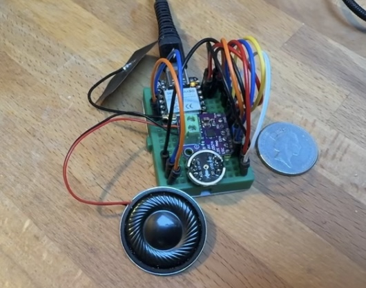

# XIAOGPT
This is a miniaturized version of my <A href=https://github.com/astromikemerri/ESPGPT>ESPGPT project</a>, designed to see quite how small a box I could fit it in.  I also added in voice cloning using the ElevenLabs API, and a RAG layer with biographical facts about me to inform the ChatGPT responses, to create a digital mini-me!

To make things as small as possible, I have switched to an even smaller microcontroller (with the added benefit of built-in battery management for a stand-alone device), removed the push-button-to-speak by using simple voice activation instead, done away with the SD card for storing audio files by using a SPIFFS file system for storage in microcontroller memory, and replaced the separate LED status indicator with the on-board LED.

So, the hardware required for this stripped-down version is just:
<ul>
  <li> Seeed Studio XIAO ESP32S3 microcontroller</li>
  <li> INMP441 I2S microphone</li>
  <li> Max98357 I2S audio amplifier breakout board</li>
  <li> 3W 8 ohm speaker</li>
  <li> (and a suitable recahrgeable battery like a 3.7V 300mAh 602030 Li-Po and an on-off sswitch if you want to create a stand-alone version) </li>
</ul>
This should all fit on a mini breadboard (<A href=XIAOGPT.fzz>here's the Frizing file</A>):

and physically end up looking something like this (with a 10p for scale):

<A HREF=XIAOGPTdist.ino>The code to make all of this work</a> calls APIs from both OpenAI (for speech-to-text and ChatGPT) and ElevenLabs (with whom I generated a clone of my voice for the text-to-speech implementation, so I could the project pretend to be me.  If you want to keep things simpler and don't want to use a voice clone, check out the code for the <A href=https://github.com/astromikemerri/ESPGPT>original procet, which just uses the generic OpenAI TTS, so no need to sign up with ElevenLabs. Note that to use these APIs, you need saccess to both OpenAI and ElevenLabs, WHICH MAY COST MONEY.  Information on the cost of these services is available for both <A href=https://openai.com/api/pricing/>OpenAI</a> and <a href=https://elevenlabs.io/pricing>ElevenLabs</a>

